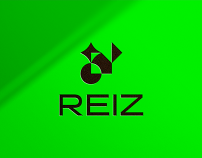

<div align="center">
  
  <br/>

  <h3>REIZ TECH ASSESMENT</h3>

</div>

<!-- TABLE OF CONTENTS -->

# 📗 Table of Contents

- [📖 About the Project](#about-project)
  - [🛠 Built With](#built-with)
    - [Tech Stack](#tech-stack)
    - [Key Features](#key-features)
  - [🚀 Project Intro Video](#project-intro-video)  
  - [🚀 Live Demo](#live-demo)
- [💻 Getting Started](#getting-started)
  - [Prerequisites](#prerequisites)
  - [Setup](#setup)
  - [Install](#install)
  - [Usage](#usage)
- [👥 Authors](#authors)
- [🤝 Contributing](#contributing)
- [⭐️ Show your support](#support)
- [🙏 Acknowledgements](#acknowledgements)
- [📝 License](#license)

<!-- PROJECT DESCRIPTION -->

# 📖 Front-End Assesment <a name="about-project"></a>

This project is an interactive interface that utilizes an external API to fetch and display a comprehensive list of countries. The user-friendly application offers a range of features aimed at enhancing the user experience. Users are provided with the ability to filter the displayed countries based on various criteria, enabling them to narrow down their search. The interface also incorporates a pagination system, ensuring that the data is presented across multiple pages, promoting a more organized and manageable browsing experience.

## 🛠 Built With <a name="built-with"></a>

### Tech Stack <a name="tech-stack"></a>

  <ul>
    <li><a href="https://reactjs.org/">React.js</a></li>
     <li><a href="https://www.typescriptlang.org/">Typescript</a></li>
      <li><a href="https://www.styled-components.com/">Styled-Components</a></li>
  </ul>

<!-- Features -->

### Key Features <a name="key-features"></a>

- **Display all data list**
- **Data Filters**
- **Pagination**

<!-- INTODUCTION VIDEO -->

## 🚀 Project Intro Video <a name="project-intro-video"></a>

- [Project Intro Video](https://www.loom.com/share/abe2034447f949a99e3dcf421b6f8d90?sid=22bac23b-8124-4615-b793-e43292a06fbd)

<!-- LIVE DEMO -->

## 🚀 Live Demo <a name="live-demo"></a>

- [Live Demo Link](https://levy-ukwishaka-reiz-tech-assignment.netlify.app/)

<!-- GETTING STARTED -->

## 💻 Getting Started <a name="getting-started"></a>

To get a local copy up and running, follow these steps.

### Prerequisites

In order to run this project you need:
 
 - Code editor
 - Browser

### Setup

Clone this repository to your desired folder:

```sh
  git clone git@github.com:levy002/reiz_tech_assesment.git
```

### Install

Install this project with:

```sh
  cd <directory>
  npm install
```

### Usage

To run the project, execute the following command:


```sh
  npm start
```

<!-- AUTHORS -->

## 👥 Authors <a name="authors"></a>

👤 **LEVY UKWISHAKA**

- GitHub: [@levy002](https://github.com/levy002)
- Twitter: [@levy_ukwishaka](https://twitter.com/levy_ukwishaka)
- LinkedIn: [@levy-ukwishaka](https://www.linkedin.com/in/levy-ukwishaka/)

<!-- CONTRIBUTING -->

## 🤝 Contributing <a name="contributing"></a>

Contributions, issues, and feature requests are welcome!

Feel free to check the [issues page](../../issues/).

<!-- SUPPORT -->

## ⭐️ Show your support <a name="support"></a>

If you like this project please leave ⭐️ 

<!-- ACKNOWLEDGEMENTS -->

## 🙏 Acknowledgments <a name="acknowledgements"></a>

I would like to thank Reiz Tech for effering me the opportunity to work on this assesment 

<!-- LICENSE -->

## 📝 License <a name="license"></a>

This project is [MIT](./LICENSE) licensed.

